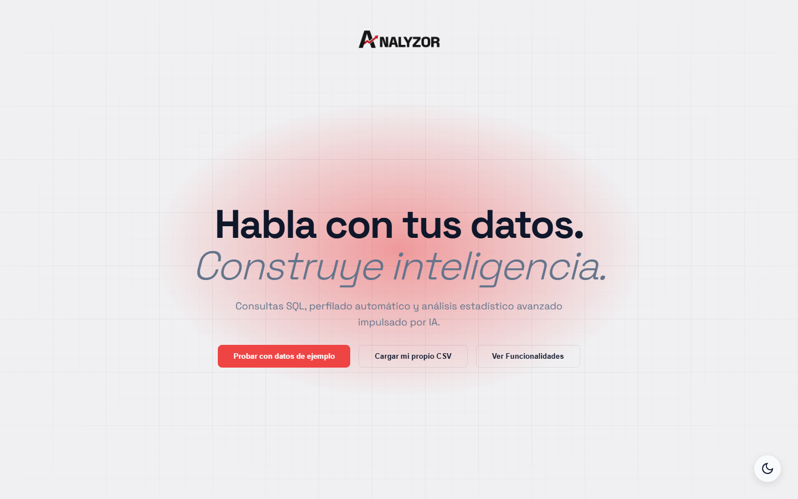
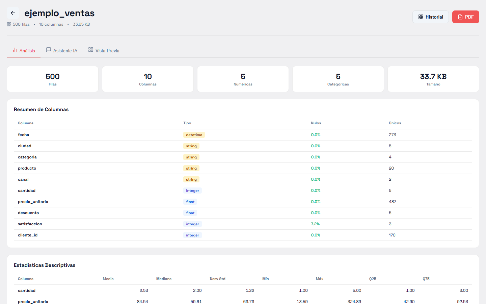
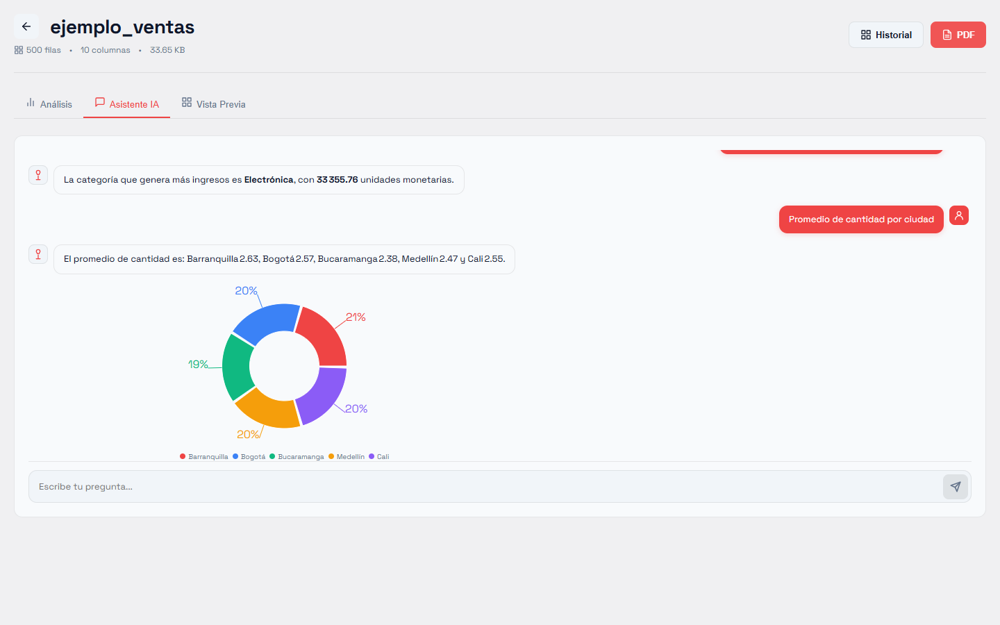

# Analyzor

**Habla con tus datos.** Sube un CSV, haz preguntas en lenguaje natural y obtén respuestas con tablas, gráficos y un reporte PDF. Todo el análisis corre en tu navegador: el archivo no se sube a ningún servidor.

**▶ Demo en vivo: [analyzor.vercel.app](https://analyzor.vercel.app)** · pulsa *Probar con datos de ejemplo* y tendrás un dashboard en un clic.




## Qué puedes hacer

- **Chat con IA + respaldo local.** La IA convierte tu pregunta en SQL; si no está disponible o alcanzó su límite, un motor de reglas resuelve las preguntas comunes (promedio, suma, máximo, conteos, agrupaciones…).
- **Perfilado automático.** Media, mediana, desviación, cuartiles, correlaciones, calidad de datos y anomalías.
- **Gráficos** elegidos según el resultado de cada consulta.
- **Reporte PDF** generado en el navegador.
- **CSV de Excel en español.** Detecta la codificación (Latin-1), el separador `;` y la coma decimal.
- **Datos de ejemplo** de una tienda (500 ventas de 2025) para probarlo sin subir nada.

| Análisis automático | Asistente con IA |
|---|---|
|  |  |

## Cómo funciona

Los datos **nunca salen de tu navegador**. El análisis corre localmente con DuckDB compilado a WebAssembly; solo la traducción "pregunta → SQL" usa una IA externa, y a ella se le envía únicamente el **esquema de columnas y hasta 5 filas de muestra**.

```
Navegador (React)                                     Cloudflare Worker          Groq
 ├─ DuckDB-WASM: perfilado estadístico y SQL      ┐
 ├─ IndexedDB: datasets y historial del chat      ├─ POST /api/sql, /api/answer ─▶ gpt-oss
 ├─ PDF generado en el cliente (jsPDF)            │   · la API key vive solo aquí
 └─ Motor de reglas (si la IA no está disponible) ┘   · origen permitido, tamaño y ráfagas limitados
                                                      · cuota diaria por usuario y global (Durable Object)
```

- **Seguridad del SQL:** solo se acepta una consulta `SELECT`, sin funciones de lectura de archivos, y corre en el sandbox del navegador.
- **Límites de uso de la IA:** el Worker cuenta las llamadas por IP y en total cada día (UTC). Al superarlas responde `429` y el chat sigue funcionando con el motor de reglas, avisando al usuario.
- **Sin servidor de datos:** no hay base de datos, ni disco, ni arranque en frío. Cuesta $0 en los planes gratuitos.

## Estructura

```
frontend/            React + Vite
  src/engine/        Motor local: DuckDB, perfilado, chat, PDF, IndexedDB
  src/api/           Adaptadores que exponen el motor con la forma de API que usa la UI
  src/pages, components/
  public/ejemplo_ventas.csv   Dataset de ejemplo (scripts/generate-sample-data.mjs)
worker/              Cloudflare Worker: proxy de IA, validación y cuotas de uso
docs/screenshots/    Capturas del README (npm run screenshots)
```

## Desarrollo local

Requisitos: Node 20+.

```bash
cd frontend
npm install
npm run dev          # http://localhost:5173
npm test             # pruebas del motor
npm run lint
```

Sin más configuración la app funciona con el motor de reglas. Para activar la IA en local:

```bash
cd worker
npm install
npx wrangler dev --var GROQ_API_KEY:<tu-clave>     # http://localhost:8787
# en otra terminal, en frontend/.env.local:
#   VITE_LLM_URL=http://localhost:8787
```

> No pegues la clave en el código ni en el repo (`.env.local` está ignorado por git). `npm run smoke` en `worker/` prueba la IA real de extremo a extremo con la clave de tu entorno (`GROQ_API_KEY`).

Regenerar las capturas del README (con la app corriendo):

```bash
cd frontend
npm run screenshots
```

## Despliegue

**1. Worker de IA (Cloudflare, plan gratuito)**

```bash
cd worker
npx wrangler login
npx wrangler secret put GROQ_API_KEY        # copia la clave (empieza por gsk_) y pégala con clic derecho
# revisa ALLOWED_ORIGINS en wrangler.toml: debe ser el dominio exacto de tu frontend
npx wrangler deploy                         # imprime la URL del Worker
```

El primer despliegue crea también el Durable Object `UsageCounter` (contadores de cuota). Los topes diarios se ajustan en `wrangler.toml` con `DAILY_LIMIT_PER_IP` y `DAILY_LIMIT_GLOBAL` (cada pregunta del chat usa 1 o 2 llamadas de IA). Para ver errores en vivo: `npx wrangler tail analyzor-llm`.

**2. Frontend en Vercel** (también sirve Cloudflare Pages u otro hosting estático)

- Conecta el repositorio. Directorio raíz: `frontend` · Comando de build: `npm run build` · Salida: `dist`.
- Variable de entorno: `VITE_LLM_URL` = la URL del Worker, aplicada a **Production**. Se lee al construir, así que hay que redesplegar tras cambiarla.
- `frontend/vercel.json` reescribe todas las rutas a `index.html`, para que recargar `/dashboard/…` o compartir ese enlace funcione.

Los binarios de DuckDB-WASM (~35 MB) se descargan del CDN de jsDelivr en la primera visita y quedan en caché; no se suben al hosting.

## Límites conocidos

- Los datasets viven en el navegador (IndexedDB): borrar los datos del sitio los elimina. Tamaño máximo: 200 MB por CSV.
- Las copias de prueba (*preview*) de Vercel no tienen IA: el Worker solo acepta el dominio de producción. Ahí el chat usa el motor de reglas.
- Los límites y modelos de los planes gratuitos (Groq, Cloudflare, Vercel) cambian con el tiempo. El modelo se configura con `GROQ_MODEL` (por defecto `openai/gpt-oss-120b`; Groq retiró `llama-3.3-70b-versatile` el 16/08/2026, consulta [la lista de deprecaciones](https://console.groq.com/docs/deprecations)). El plan gratuito de Vercel (Hobby) es solo para uso no comercial.
- La versión anterior (Django + PostgreSQL en Render) está disponible en el tag `legacy-django`.

## Camino a producto

La persistencia pasa por `frontend/src/engine/store.js`. Para cuentas de usuario y sincronización entre dispositivos basta con implementar la misma interfaz sobre un servicio como Supabase (Auth + Storage) y aplicar cuotas por usuario en el Worker.
